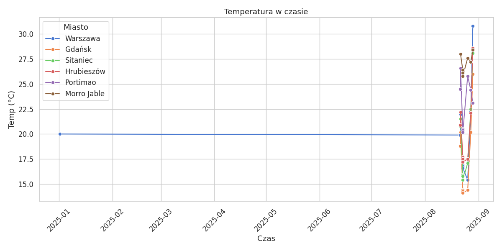

# ETL Weather Pipeline

Kompletny pipeline ETL w Pythonie.
Pobieranie danych pogodowych z API, czyszczenie i walidacja, zapis do PostgreSQL (Docker) oraz analiza w Jupyter Notebook.
Projekt zawiera też testy jednostkowe i CI/CD (GitHub Actions).

---

# Funkcjonalności

* **Extract** – pobieranie danych pogodowych z [Open-Meteo API](https://open-meteo.com/).
* **Transform** – walidacja, czyszczenie i opis warunków pogodowych (pandas).
* **Load** – zapis danych do lokalnej bazy **PostgreSQL** uruchomionej w Dockerze.
* **Analiza i wizualizacja** – Jupyter Notebook + matplotlib/seaborn.
* **Testy i CI/CD** – pytest, GitHub Actions (lint + testy przy każdym pushu).

# Stack technologiczny

* **Python 3.11**

  * pandas, requests, SQLAlchemy, pytest
  * matplotlib, seaborn (wizualizacje)
  * python-dotenv (obsługa `.env`)
* **PostgreSQL 15** (Docker Compose)
* **Jupyter Notebook**
* **GitHub Actions** (CI/CD)

# Struktura projektu

```
etl_project/
│── fetch_weather.py        # Extract - pobieranie danych z API
│── transform_weather.py    # Transform - czyszczenie i walidacja
│── load_weather.py         # Load - zapis do PostgreSQL
│── run_pipeline.py         # Uruchomienie całego ETL
│── requirements.txt        # Zależności Pythona
│── docker-compose.yml      # Kontener PostgreSQL
│── .env                    # Konfiguracja bazy
│── ci.yml                  # Workflow GitHub Actions (CI/CD)
│── .gitignore              # Ignorowane pliki i foldery w repo
│── readme.md               # Dokumentacja projektu
│── tests/                  # Testy jednostkowe (pytest)
│── notebooks/
│    └── analysis.ipynb     # Analiza i wizualizacje
```

---

# Uruchomienie lokalne

1. **Sklonuj repozytorium:**

   ```bash
   git clone https://github.com/your-username/etl-weather-pipeline.git
   cd etl-weather-pipeline
   ```

2. **Skonfiguruj plik `.env`:**

   ```ini
   POSTGRES_USER=user
   POSTGRES_PASSWORD=password
   POSTGRES_DB=etl_db
   POSTGRES_HOST=localhost
   POSTGRES_PORT=5432
   ```

3. **Uruchom PostgreSQL w Dockerze:**

   ```bash
   docker compose up -d
   ```

4. **Zainstaluj zależności:**

   ```bash
   pip install -r requirements.txt
   ```

5. **Uruchom pipeline ETL:**

   ```bash
   python run_pipeline.py
   ```

6. **Sprawdź dane w bazie:**

   ```bash
   docker exec -it postgres_db psql -U user -d etl_db -c "SELECT * FROM weather LIMIT 5;"
   ```

7. **Analiza danych w Jupyter Notebook:**

   ```bash
   jupyter notebook notebooks/analysis.ipynb
   ```

---

## Uruchamianie lint i testów przez Makefile

Aby ułatwić pracę lokalnie, przygotowano Makefile do szybkiego uruchamiania formatowania i testów.

* **Lint (sprawdzenie formatowania kodu i zgodności ze stylem)**

```bash
make lint


Przy każdym **pushu** GitHub Actions:

* sprawdza formatowanie (`black`, `flake8`)
* uruchamia testy (`pytest`)
* odpala serwis PostgreSQL w kontenerze testowym

---

# Wizualizacje

Przykłady wykresów z `analysis.ipynb`:

* Średnia temperatura w miastach (barplot)
* Zmiany temperatury w czasie (lineplot)
* Rozkład warunków pogodowych (countplot)
* Zależność prędkości wiatru i temperatury (scatterplot)

Tutaj możesz dodać swoje obrazki PNG z folderu `/docs/plots/`, np.:

```markdown




```

---

# Cele projektu

Ten projekt pokazuje w praktyce:

* integrację z API
* podstawowy **ETL pipeline**
* obsługę baz danych w Dockerze
* testy jednostkowe i CI/CD
* analizę danych i wizualizacje w Pythonie

# Autor

Projekt przygotowany w celach edukacyjnych i demonstracyjnych.
Możesz mnie znaleźć na GitHubie: [tomsongracz](https://github.com/tomsongracz)
